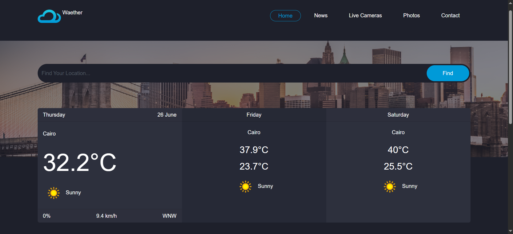

# WeatherNow-v1

# WeatherNow v1.1 🌤️

A simple weather forecasting web app built using HTML, CSS, and JavaScript. It fetches real-time weather data from the [WeatherAPI](https://www.weatherapi.com/) and displays the current weather along with a 3-day forecast.

## 🚀 Features

- 🌍 Auto-detects your location using Geolocation API
- 🔍 Search by city or coordinates
- 📅 Displays weather for today + 2 upcoming days
- 🌡️ Shows temperature, wind speed/direction, rain chance, and condition icons
- ⚡ Debounced search input to reduce API calls

## 🧪 Demo

Try it live: [https://your-github-username.github.io/WeatherNow-v1](#) _(replace with your live link if deployed)_

## 🖼️ Screenshots



## 📦 Installation

1. Clone the repository:
   ```bash
   git clone https://github.com/YoussefElshahat/WeatherNow-v1.git
   cd WeatherNow-v1
   ```

🔑 API Key
This project uses the free WeatherAPI service. You must insert your own API key in main.js:

js Copy code
const apiKey = "your_api_key_here";
Replace "your_api_key_here" with your own key from WeatherAPI.

⚙️Built With
HTML5
CSS3 (with Bootstrap classes)
JavaScript (ES6+)
WeatherAPI
